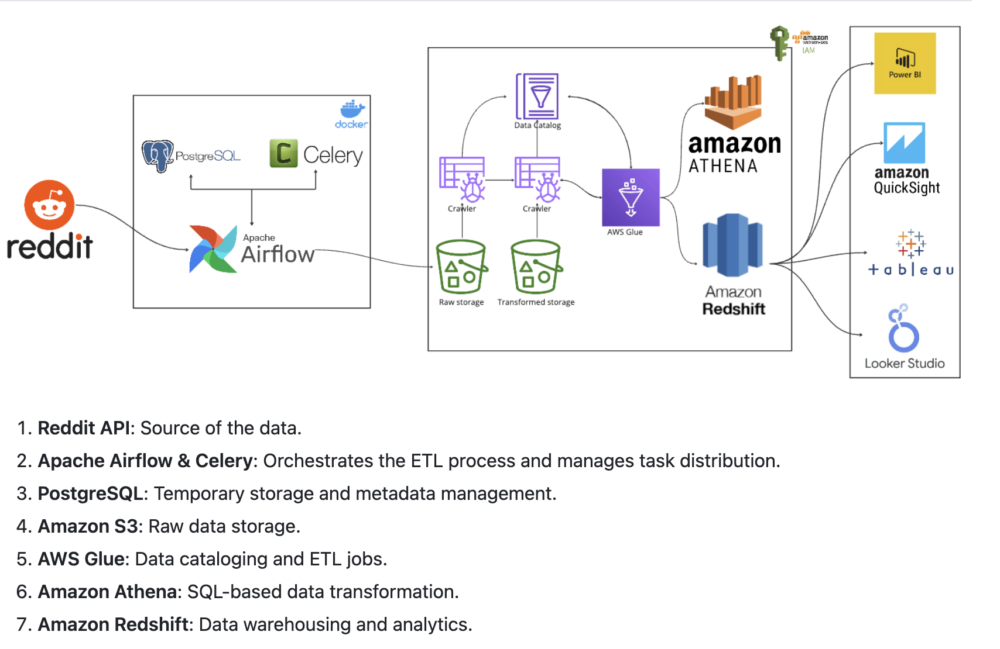

# Reddit to AWS ETL Data Pipeline



This project builds an end-to-end ETL pipeline using **Apache Airflow**, **Docker**, **AWS S3**, **AWS Glue**, **Amazon Athena**, and optionally **Amazon Redshift**. The pipeline extracts top posts from a subreddit via the Reddit API and makes the data available for querying and visualization.

---

## 🚀 Tech Stack

- **Apache Airflow** (Docker-based)
- **Reddit API (praw)**
- **AWS S3**
- **AWS Glue + Glue Crawler**
- **Amazon Athena** (SQL query engine)
- **Amazon Redshift** (optional)
- **Power BI / Tableau / QuickSight / Looker Studio** (for dashboarding)

---

## 📂 Project Structure

```
.
├── config/                 # Contains config.conf with credentials and paths
├── dags/                   # Airflow DAGs
├── data/                   # Input/output data files
├── etls/                   # ETL logic (Reddit, AWS, etc.)
├── logs/                   # Airflow logs
├── pipelines/              # Wrappers for pipeline steps
├── tests/                  # Testing scripts
├── utils/                  # Helper modules and constants
├── airflow.env             # Airflow environment variables
├── docker-compose.yml      # Docker configuration
├── Dockerfile              # Custom Airflow image
├── requirements.txt        # Python dependencies
```

---

## ⚖️ Workflow Overview

1. **Initialize Airflow** with Docker Compose
2. **DAG runs daily**
3. Extracts top 100 posts from a subreddit (e.g., `r/dataengineering`)
4. Transforms and saves data as `.csv`
5. Uploads CSV to **AWS S3 (raw)**
6. **AWS Glue job** transforms and writes to **S3 (transformed)**
7. **Glue Crawler** creates schema in **Data Catalog**
8. Data is queried using **Athena**, optionally loaded to **Redshift**
9. Data visualized with **BI tools**

---

## ⚡ Prerequisites

- Docker & Docker Compose
- AWS account with:
  - S3 access
  - Glue access
  - Athena setup
- Reddit API credentials

---

## 📑 Setup Instructions

### 1. Clone and Structure Project
```bash
mkdir config dags data etls logs pipelines tests utils
cd project-root
touch airflow.env docker-compose.yml Dockerfile
pip freeze > requirements.txt
docker compose up -d --build
```

### 2. Configure Secrets
Add your secrets and settings in `config/config.conf`:
```
[api_keys]
reddit_client_id = YOUR_CLIENT_ID
reddit_secret_key = YOUR_SECRET_KEY

[aws]
aws_access_key_id = YOUR_AWS_KEY
aws_secret_access_key = YOUR_SECRET
aws_region = us-east-1
aws_bucket_name = dataeng-reddit
```

---

## 📊 DAG: reddit_dag.py

### Tasks:
- **reddit_extraction**: Extracts + transforms + saves to CSV
- **s3_upload**: Uploads CSV to `s3://dataeng-reddit/raw/`

---

## 💡 AWS Glue & Athena Steps

### Glue Job:
1. Input: `s3://dataeng-reddit/raw/`
2. Clean & transform
3. Output: `s3://dataeng-reddit/transformed/`

### Glue Crawler:
- Creates Athena table from transformed data

### Athena:
- Run SQL queries:
```sql
SELECT title, score FROM reddit_transformed WHERE score > 100;
```

---

## 📈 Visualization Options

Connect BI tools (Power BI, Tableau, QuickSight, Looker Studio) to:
- Athena
- Redshift

Build dashboards for:
- Top scoring posts
- NSFW % analysis
- Upvotes vs comments trends

---

## ✅ Todo / Improvements
- Add more subreddit options
- Build CLI for dynamic DAG trigger
- Auto-load to Redshift
- Alerting via Slack

---


Created by **Sathwik Reddy Chelemela** as a portfolio ETL project demonstrating data engineering workflows using Airflow and AWS.

---


MIT License
